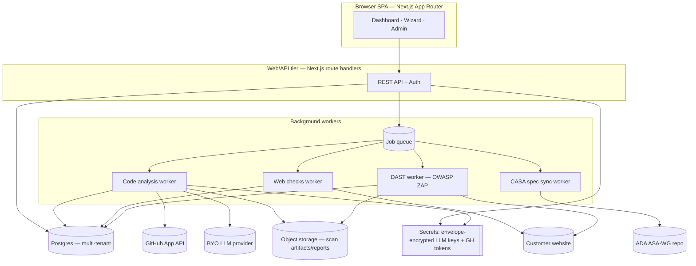
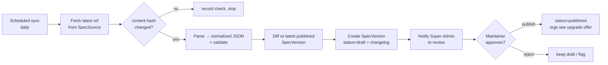
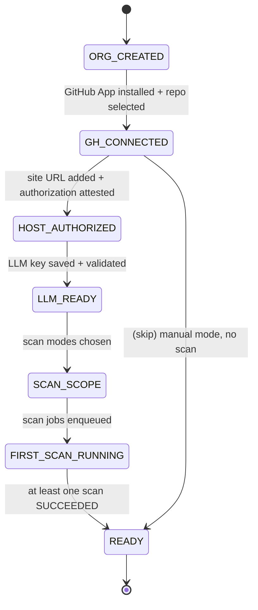

# Attestor — Open CASA Self-Assessment Platform
### Product & Technical Specification

> **Working title:** *Attestor* (final name TBD). Do **not** ship a product name containing
> "CASA" — that term is associated with the App Defense Alliance program. See [§19 Naming & Legal](#19-naming-trademark--legal).

**Status:** Draft v0.2 · **Owner:** AskWali · **Last updated:** 2026-06-29

This document specifies the productized, multi-tenant, open-source evolution of the internal
`casa-tracker` tool. It turns that tool into a self-serve platform where any team can sign up,
connect a GitHub repo and their website, bring their own LLM key, run an automated
pre-assessment, and manage their CASA Tier 2 self-assessment to completion — while the platform
stays continuously in sync with the upstream App Defense Alliance requirements.

---

## Table of contents
1. [Vision & objectives](#1-vision--objectives)
2. [Goals / non-goals](#2-goals--non-goals)
3. [Personas & roles (RBAC)](#3-personas--roles-rbac)
4. [Glossary](#4-glossary)
5. [High-level architecture](#5-high-level-architecture)
6. [Tenancy & data isolation](#6-tenancy--data-isolation)
7. [Authentication & authorization](#7-authentication--authorization)
8. [Feature: Onboarding wizard](#8-feature-onboarding-wizard)
9. [Feature: GitHub integration](#9-feature-github-integration)
10. [Feature: BYO LLM keys & provider abstraction](#10-feature-byo-llm-keys--provider-abstraction)
11. [Feature: Analysis engine (code + web + DAST)](#11-feature-analysis-engine-code--web--dast)
12. [Feature: Requirement tracking & evidence](#12-feature-requirement-tracking--evidence)
13. [Feature: CASA spec sync subsystem](#13-feature-casa-spec-sync-subsystem)
14. [Feature: Org & user administration](#14-feature-org--user-administration)
15. [Feature: Reporting & assessor hand-off](#15-feature-reporting--assessor-hand-off)
16. [Data model](#16-data-model)
17. [Background jobs & queue](#17-background-jobs--queue)
18. [API surface](#18-api-surface)
19. [Security & privacy](#19-security--privacy)
20. [Naming, trademark & legal](#19-naming-trademark--legal)
21. [Tech stack](#20-tech-stack)
22. [Deployment & operations](#21-deployment--operations)
23. [Billing & plans](#22-billing--plans)
24. [Open source & governance](#23-open-source--governance)
25. [Phased roadmap](#24-phased-roadmap)
26. [Risks & mitigations](#25-risks--mitigations)
27. [Open decisions](#26-open-decisions)

---

## 1. Vision & objectives

Most teams that receive Google's "complete a CASA Tier 2 assessment" email have no idea where to
start, scramble for six weeks, and pay a lab to tell them what they could have found themselves.
**Attestor** compresses that: connect your code and site, get an automated, evidence-backed
pre-assessment in minutes, then drive the gaps to closed and hand a clean evidence package to an
authorized lab.

Primary objectives:
- **Time-to-first-value < 15 min:** sign up → connect repo + site + LLM key → first scan complete.
- **Always current:** requirements track the upstream App Defense Alliance spec automatically.
- **Audit-ready output:** a per-requirement status + evidence package an authorized lab accepts.
- **Trustworthy by construction:** a security-compliance product must itself be exemplary on
  secrets, isolation, and supply chain.

---

## 2. Goals / non-goals

**Goals**
- Multi-tenant SaaS (many orgs on one deployment) — see [§6](#6-tenancy--data-isolation).
- GitHub repo connection (read-only) via a GitHub App.
- Bring-your-own LLM key (Anthropic / OpenAI / others) for the analysis engine.
- Automated analysis across three modes: **static code**, **website runtime checks**, **DAST**.
- Guided onboarding + per-requirement tracking, evidence collection, comments, assignment.
- Continuous sync with the upstream CASA spec, with safe per-org version upgrades.
- Org & user administration with RBAC and an audit log.
- Open-source repo + one-click self-host (Docker / Railway template) as a secondary path.

**Non-goals (v1)**
- We are **not** an authorized CASA lab and do not issue letters of validation. We prepare you
  for one. (Make this explicit in-product.)
- Not a general-purpose SAST/DAST platform — scope is CASA/ASVS requirement mapping.
- No multi-region data residency in v1 (single region; note for enterprise later).
- GitLab/Bitbucket deferred (GitHub only at launch).

---

## 3. Personas & roles (RBAC)

| Role | Scope | Can |
|---|---|---|
| **Platform Super-Admin** (maintainer) | global | Review & publish new CASA spec versions, manage feature flags, view ops dashboards. No access to tenant secrets or private code. |
| **Org Owner** | org | Everything in org incl. billing, delete org, manage SSO, rotate org secrets. |
| **Org Admin** | org | Manage members, projects, integrations (GitHub, LLM key), trigger scans, approve spec upgrades. |
| **Contributor** | project | Set requirement status, assign, comment, collect evidence, run scans. |
| **Viewer** | project | Read-only: view status, evidence, reports, export. |

- Roles are assigned per **org**, with optional per-**project** overrides (e.g. Viewer org-wide but
  Contributor on one project).
- Every state-changing action writes to an immutable **audit log** ([§16](#16-data-model)).

---

## 4. Glossary

- **Org (tenant):** a customer account; the isolation boundary for all data.
- **Project:** a single application under assessment (1 repo + 1+ site URLs). Orgs may have many.
- **Requirement:** a CASA line item (e.g. `3.3.1`) from a specific **Spec Version**.
- **Spec Version:** a parsed, immutable snapshot of the upstream CASA spec at a given upstream
  release/commit (e.g. `v2.1.1 @ <sha>`).
- **Assessment:** an org/project's mutable tracking state against a pinned Spec Version.
- **Scan:** one execution of the analysis engine (code / web / DAST) producing findings.
- **Evidence artifact:** a concrete proof item (code ref, config, screenshot, scan output, doc).

---

## 5. High-level architecture



The web tier is stateless and horizontally scalable. All long-running work (clone, LLM calls,
ZAP scans, spec ingestion) runs in workers off a durable queue so requests never block and scans
survive deploys.

---

## 6. Tenancy & data isolation

**Model:** shared-schema multi-tenancy. Every tenant-owned row carries `orgId`. Isolation is
enforced in three layers (defense in depth):

1. **Application layer:** a request-scoped Prisma client middleware injects `orgId` filters on
   every query; a central `assertOrgAccess()` guard runs in every API handler.
2. **Database layer:** Postgres **Row-Level Security (RLS)** policies keyed on a
   `SET app.current_org` session var, so even a missed filter cannot leak cross-tenant rows.
3. **Object storage:** artifacts are namespaced by `orgId/projectId/...` and served only via
   short-lived signed URLs scoped to the requesting session.

Hard rules:
- No endpoint accepts `orgId` from the client; it is always derived from the authenticated
  session/membership.
- Background jobs carry an explicit `orgId` in the payload and set the RLS session var.
- Secrets (LLM keys, GH tokens) are per-org and never cross the tenant boundary.

> Self-host deployments simply run with a single org; the multi-tenant model degrades cleanly.

---

## 7. Authentication & authorization

- **Identity:** Auth.js (NextAuth). Sign-in via email magic link + GitHub OAuth. Passwords
  optional (Argon2id if enabled).
- **Org SSO (enterprise):** SAML / OIDC per-org, with SCIM provisioning (post-v1).
- **Sessions:** httpOnly, Secure, SameSite=Lax cookies; short-lived rotating tokens; idle +
  absolute timeouts. Session invalidation on password/role change.
- **MFA:** TOTP for all users; **required** for Owner/Admin and Super-Admin. (We can't credibly
  flag "admin MFA" as a CASA requirement and not enforce our own.)
- **Authorization:** central policy module (CASL-style abilities) mapping role × resource ×
  action. Every API handler calls `authorize(user, action, resource)`.
- **Audit log:** append-only record of auth events, secret access, scans, spec upgrades,
  role/membership changes, exports.

---

## 8. Feature: Onboarding wizard

A linear, resumable wizard (progress persisted on the `Project`) that gets a new org to first
scan. Steps:

1. **Create org & project** — org name; project name; **attest you are authorized to assess this
   application** (legal gate, recorded with timestamp + user).
2. **Connect GitHub** — install the GitHub App, pick the repo + default branch. Validates
   read access. ([§9](#9-feature-github-integration))
3. **Add website URL(s)** — production + optional staging. **Re-confirm authorization to scan**
   each host (required before any web/DAST probing).
4. **Add LLM key** — choose provider + model, paste key; we validate with a cheap probe call and
   store it write-only. ([§10](#10-feature-byo-llm-keys--provider-abstraction))
5. **Choose scan scope** — code (default on), web checks (default on), DAST (opt-in, with extra
   authorization + scheduling).
6. **Run initial scan** — kicks off background jobs; live progress UI. On completion, lands on the
   populated requirement dashboard with pre-filled status + evidence suggestions.
7. **Invite your team** — optional; assign owners. ([§14](#14-feature-org--user-administration))

Design notes: each step is independently re-runnable later from Settings; the wizard never blocks
on the scan (user can leave and return); a "Skip for now" path exists for every non-essential step.

---

## 9. Feature: GitHub integration

- **Mechanism:** a **GitHub App** (not a personal OAuth token) with least-privilege, read-only
  permissions: `contents:read`, `metadata:read`. Installed per-org on selected repos.
- **Why a GitHub App:** fine-grained per-repo scope, short-lived installation tokens, easy
  revocation, webhook support, higher rate limits.
- **Token handling:** installation access tokens are minted on demand (1h TTL), never persisted
  beyond cache; the long-lived value is the installation id + the App's private key (a platform
  secret, not a tenant secret).
- **Repo access for scanning:** prefer the **tarball API** (`/tarball/{ref}`) for a read-only
  snapshot at a pinned commit SHA; fall back to shallow clone in the worker's ephemeral, sandboxed
  filesystem. Code is **never persisted** after a scan — only derived findings + the SHA.
- **Webhooks (post-v1):** on `push` to the default branch, offer a "re-scan" (debounced).
- **Self-host:** support a fine-grained PAT as an alternative to the GitHub App.

---

## 10. Feature: BYO LLM keys & provider abstraction

- **Provider abstraction:** an `LLMProvider` interface (`complete()`, `completeStructured(schema)`,
  `embed()`) with adapters for **Anthropic** (default; Claude models), **OpenAI**, and a generic
  **OpenAI-compatible** endpoint (Azure/OpenRouter/self-hosted). Model + provider selectable per
  org; sane defaults per provider.
- **Key storage:** envelope encryption — a per-org **data key** wraps the secret with
  AES-256-GCM; the data key is itself encrypted by a master key held in a KMS (cloud KMS for SaaS;
  an env-provided key for self-host). Keys are **write-only** in the API (input accepted, never
  returned; UI shows provider + last-4 only).
- **Validation:** on save, a minimal probe call confirms the key works and the chosen model is
  reachable; store the result + timestamp.
- **Cost guardrails:** per-scan token budget, per-org monthly budget cap, and a live cost estimate
  shown before a full scan. Structured-output calls preferred to minimize retries.
- **Isolation:** keys are decrypted only inside the worker performing that org's scan, only for the
  duration of the call; never logged, never sent to the browser, never in error payloads.

---

## 11. Feature: Analysis engine (code + web + DAST)

The engine produces, per requirement: `status` (likely_met / partial / likely_gap / needs_review /
not_applicable), `confidence`, `finding`, `evidence[]` (with file refs / URLs), `remediation`,
`priority` (P0–P3), `effort`. Results are **suggestions** a human confirms.

### 11.1 Static code analysis (BYO LLM)
1. **Snapshot** the repo at a pinned SHA (tarball).
2. **Index** — build a lightweight retrieval index: file tree + language detection + an embeddings
   index over source files (chunked). Detect framework (Laravel, Express, Django, Rails, Next, …)
   to load framework-specific heuristics.
3. **Per-requirement retrieval** — for each requirement, select candidate files via (a) heuristic
   globs/keywords per requirement category (auth, session, crypto, validation, config, webhooks)
   and (b) embedding similarity to the requirement text + test-guide.
4. **LLM judgment** — a structured-output prompt per requirement returns the fields above. Prompts
   are versioned and stored. Map every claim to concrete file:line evidence.
5. **Cache** by `(repoSHA, specVersion, promptVersion)` so re-opening is instant and re-scans only
   re-run changed inputs.

### 11.2 Website runtime checks (no LLM required)
Automated probes against confirmed-authorized hosts, mapped to CASA items:
- **TLS/transport:** protocol versions, cipher suites, cert validity/chain, HSTS → maps to 4.1.x.
- **Security headers:** CSP, X-Frame-Options/ frame-ancestors, X-Content-Type-Options, Referrer-
  Policy, COOP/CORP → 5.1.x, 6.x.
- **Cookies:** Secure / HttpOnly / SameSite on Set-Cookie → 2.3.x.
- **Hygiene:** `APP_DEBUG`/stack-trace leakage, exposed `/.env`, `/.git/`, directory listing,
  verbose server banners, `/actuator`-style endpoints → 6.2.1, 6.x.
These auto-populate evidence artifacts (type `scan`/`screenshot`) with the raw capture stored in
object storage.

### 11.3 DAST integration
- **Engine:** orchestrate **OWASP ZAP** (baseline + optional full/active scan) in an isolated
  worker container, or **import** existing ZAP/Burp reports (XML/JSON).
- **Safety gates:** active scanning requires (a) recorded authorization for the host, (b) a
  configured scan window/rate, and (c) an explicit "active scan" opt-in (baseline/passive is the
  default). Scope is locked to the attested hosts; out-of-scope requests are blocked.
- **Mapping:** ZAP alert rules → CASA/ASVS requirement IDs via a maintained mapping table; alerts
  attach as evidence/findings with severity → priority.
- **Auth'd scans:** support an authenticated DAST context (login script / token) configured per
  project, stored as a secret.

### 11.4 Orchestration & re-scan
- A **Scan** record tracks mode, status, progress, cost, started/finished, triggering user.
- Scans are idempotent per input hash; "Re-scan" diffs against the prior scan and highlights
  newly-introduced or newly-resolved items.

---

## 12. Feature: Requirement tracking & evidence

Generalizes the existing tracker to multi-tenant + multi-project. Per requirement:
- **Human state:** status, assignee (org member), notes, threaded comments.
- **Machine suggestion:** the latest scan's status/finding/evidence/remediation/priority/effort,
  with "accept suggestion" one-click.
- **Evidence checklist:** typed artifacts (code/config/screenshot/scan/policy/test/doc) with
  guidance, a "collected" toggle, and a location/link; supports auto-attached scan artifacts and
  custom items.
- **Filters & progress:** by chapter/status/assignee/priority + search; overall %, status
  breakdown, evidence-collected count, P0/P1 burn-down.
- **Exports:** status CSV, evidence CSV, full JSON, and the assessor PDF ([§15](#15-feature-reporting--assessor-hand-off)).

(This is the current `casa-tracker` feature set, re-homed under `orgId`/`projectId` and tied to a
pinned Spec Version.)

---

## 13. Feature: CASA spec sync subsystem

**Requirement:** the platform must always reflect the upstream App Defense Alliance requirements
and let us review/apply new or changed requirements. Source of truth:
`github.com/appdefensealliance/ASA-WG` → `CASA/CASA Specification.md` (+ `CASA Test Guide.md`).

### 13.1 Concepts
- **SpecSource** — the upstream repo + path + tracked ref (a release tag like `v2.1.1`, or
  `develop`). Configurable; defaults to the official ADA repo.
- **SpecVersion** — an **immutable** parsed snapshot: `{ version, upstreamSha, parsedAt, rawSpec,
  parsedJson, contentHash, status: draft|published|archived }`. Parsed JSON = chapters → controls →
  line items (the existing `parse.mjs` logic, hardened and versioned).
- **Assessment pinning** — each project pins exactly one **published** SpecVersion. Orgs upgrade
  on their own schedule; nothing changes under them silently.

### 13.2 Sync pipeline


- **Scheduling:** a daily job (configurable) checks the tracked ref; also support GitHub webhook /
  manual "Check now". Releases/tags are preferred over raw `develop` for stability.
- **Diff engine:** field-level diff keyed on requirement ID across `{added, removed, modified}`,
  where `modified` reports which fields changed (description, scope, test-guide URL, control
  grouping). Produces a human-readable changelog stored on the SpecVersion.
- **Review gate:** new SpecVersions land as **draft**; a Platform Super-Admin reviews the parsed
  diff (a bad upstream edit or a parser regression must not auto-propagate to tenants). Approval
  flips to **published**. (Self-host: a config flag can auto-publish.)
- **Parser robustness:** the parser is a versioned module with a golden-file test suite (current
  spec snapshots) so upstream formatting changes fail loudly in CI rather than silently dropping
  requirements. Store the raw spec so we can re-parse historically.

### 13.3 Per-org upgrade flow
When a newer published SpecVersion exists than a project's pinned version:
1. Org admin sees an **"Updated CASA requirements available"** banner with the changelog.
2. Clicking **Review upgrade** shows a migration preview:
   - **Carried over:** requirements with stable IDs — human state (status/assignee/notes/comments/
     evidence) is preserved.
   - **New:** requirements added upstream → seeded as `NOT_STARTED`, flagged **"needs triage"**.
   - **Removed:** requirements no longer in the spec → state **archived** (not deleted), hidden by
     default.
   - **Materially changed:** requirements whose text/scope changed → state carried but flagged
     **"re-review"** (so a previously-Met item gets re-examined against the new wording).
   - **Renumbered/moved:** resolved via an ID-mapping table + similarity heuristic; ambiguous moves
     surface for **manual mapping** before the upgrade commits.
3. Admin confirms → assessment re-pins to the new SpecVersion atomically; the prior state snapshot
   is retained for rollback/audit.

### 13.4 Data integrity
- Upgrades are transactional and produce an audit entry with a before/after summary.
- Evidence artifacts and scan findings are linked to requirement IDs, so they re-associate on
  upgrade (with re-review flags where wording changed).

---

## 14. Feature: Org & user administration

- **Org settings:** name, branding (logo), default LLM provider/model, scan scope defaults,
  data-retention policy, danger zone (delete org).
- **Members:** invite by email (tokenized, expiring), assign role, deactivate, transfer ownership.
  Pending invites list. Optional domain-capture (auto-join for verified email domain).
- **Projects:** create/rename/archive; per-project integration + scan settings; per-project role
  overrides.
- **Integrations:** GitHub App install/uninstall, LLM key management, DAST config, webhooks.
- **Audit log viewer:** filterable by actor/action/resource/time; export.
- **Notifications:** email (and optional Slack webhook) for scan complete, new spec version, P0
  finding, invite, assignment.

---

## 15. Feature: Reporting & assessor hand-off

- **Assessor package (PDF + ZIP):** cover sheet (org, project, app URL, spec version, date), a
  per-requirement table (status, finding, evidence list with links), and an appendix bundling
  evidence artifacts (scan outputs, screenshots, config snippets) from object storage.
- **Self-assessment questionnaire export:** mapped to the CASA Tier 2 self-assessment format so it
  can be submitted/handed to the lab (e.g. TAC Security).
- **Live exports:** status CSV, evidence CSV, JSON (existing), plus a shareable read-only
  report link (signed, expiring, optional).
- **Progress dashboard:** P0/P1 burn-down over time, evidence-collected trend, scan history.

---

## 16. Data model

Prisma sketch (multi-tenant; abbreviated — every tenant row has `orgId` + RLS):

```prisma
model Org { id String @id @default(cuid()) name String plan String @default("free")
  createdAt DateTime @default(now()) members Membership[] projects Project[] secrets Secret[] }

model User { id String @id @default(cuid()) email String @unique name String? mfaEnabled Boolean @default(false)
  memberships Membership[] }

model Membership { id String @id @default(cuid()) orgId String userId String role Role
  @@unique([orgId, userId]) }
enum Role { OWNER ADMIN CONTRIBUTOR VIEWER }

model Project { id String @id @default(cuid()) orgId String name String
  githubInstallationId String? repoFullName String? defaultBranch String?
  websiteUrls String[] authorizedHosts String[] authorizedAt DateTime?
  specVersionId String     // pinned published SpecVersion
  onboardingStep Int @default(0) createdAt DateTime @default(now()) }

model Secret { id String @id @default(cuid()) orgId String kind SecretKind  // LLM_KEY | DAST_AUTH | ...
  provider String? last4 String ciphertext Bytes dataKeyWrapped Bytes createdAt DateTime @default(now()) }
enum SecretKind { LLM_KEY GITHUB_PAT DAST_AUTH }

model SpecSource { id String @id @default(cuid()) repo String path String trackedRef String @default("develop") }

model SpecVersion { id String @id @default(cuid()) sourceId String version String upstreamSha String
  rawSpec String contentHash String parsedJson Json changelog Json
  status SpecStatus @default(DRAFT) parsedAt DateTime @default(now()) publishedAt DateTime? }
enum SpecStatus { DRAFT PUBLISHED ARCHIVED }

// Per-project assessment state, tied to a pinned SpecVersion
model RequirementState { id String @id @default(cuid()) orgId String projectId String
  requirementId String  // e.g. "3.3.1" within the pinned SpecVersion
  status ReqStatus @default(NOT_STARTED) assigneeId String? notes String @default("")
  reviewFlag String?    // "needs_triage" | "re_review" | null
  // latest machine suggestion
  suggestedStatus String? suggestedFinding String? suggestedRemediation String?
  suggestedPriority String? suggestedEffort String? evidenceRefs String[]
  @@unique([projectId, requirementId]) }
enum ReqStatus { NOT_STARTED IN_PROGRESS MET GAP NEEDS_REVIEW NOT_APPLICABLE ARCHIVED }

model EvidenceItem { id String @id @default(cuid()) orgId String projectId String requirementId String
  key String label String type String guidance String custom Boolean @default(false)
  collected DateTime? location String @default("") artifactBlobKey String? }

model Comment { id String @id @default(cuid()) orgId String projectId String requirementId String
  authorId String body String createdAt DateTime @default(now()) }

model Scan { id String @id @default(cuid()) orgId String projectId String mode ScanMode
  status ScanStatus repoSha String? cost Float? startedAt DateTime finishedAt DateTime? triggeredById String
  resultBlobKey String? }
enum ScanMode { CODE WEB DAST }
enum ScanStatus { QUEUED RUNNING SUCCEEDED FAILED CANCELLED }

model AuditEvent { id String @id @default(cuid()) orgId String actorId String? action String
  resource String metadata Json createdAt DateTime @default(now()) }
```

---

## 17. Background jobs & queue

- **Queue:** Redis + **BullMQ** (or Postgres-native **Graphile Worker** to avoid Redis for
  self-host simplicity — see [§26](#26-open-decisions)). Durable, retried, with dead-letter.
- **Job types:** `code-scan`, `web-checks`, `dast-scan`, `spec-sync`, `spec-upgrade`,
  `send-notification`, `build-report`.
- **Properties:** every job payload carries `orgId`; workers set the RLS session var; idempotency
  keys prevent duplicate scans; per-org concurrency limits; cost/token budgets enforced; structured
  progress events streamed to the UI (SSE/WebSocket).
- **Isolation:** DAST and code-clone jobs run in sandboxed, egress-limited worker containers;
  scratch filesystem is wiped after each job.

---

## 18. API surface

REST under `/api`, all org-scoped via session (never client-supplied `orgId`):

```
POST   /api/orgs                              create org
GET    /api/orgs/:org/members                 list / POST invite / PATCH role / DELETE
POST   /api/orgs/:org/secrets                 add LLM key / DAST auth (write-only)
GET    /api/orgs/:org/projects                CRUD projects
POST   /api/projects/:id/github/connect       start GitHub App install / select repo
POST   /api/projects/:id/authorize-host       record scan authorization for a URL
POST   /api/projects/:id/scans                trigger scan { mode } → returns Scan
GET    /api/projects/:id/scans/:scanId        status + progress (SSE stream variant)
GET    /api/projects/:id/requirements         requirements + state + evidence + comments
PATCH  /api/projects/:id/requirements/:rid    status / assignee / notes
POST   /api/projects/:id/requirements/:rid/comments
PATCH  /api/evidence/:id                       collected / location ; POST add ; DELETE custom
GET    /api/projects/:id/report                build/download assessor package
GET    /api/projects/:id/spec/upgrade          preview upgrade ; POST apply
# platform
GET    /api/admin/spec-versions               list ; GET diff ; POST publish/reject
POST   /api/admin/spec-sync/run               manual sync trigger
```

All mutations: authorize → validate (zod) → act → audit. Rate-limited per org + per IP.

---

## 19. Security & privacy

This product holds customers' source-code access, site-scan authority, and LLM keys — it must be
exemplary (and should pass its own CASA bar).

- **Secrets:** envelope encryption (KMS-wrapped per-org data keys, AES-256-GCM); write-only API;
  never logged or returned; rotation supported; decrypt only in-worker, in-memory, per-use.
- **Tenant isolation:** app-layer org filter + Postgres RLS + namespaced signed-URL object storage.
- **Least privilege GitHub:** read-only GitHub App, short-lived installation tokens, source code
  never persisted post-scan (only findings + SHA).
- **Scan authorization:** active web/DAST scanning gated on recorded, per-host authorization +
  scope locking + opt-in for active scans — prevents the platform being used to attack third
  parties.
- **App auth:** MFA-required admins, session hardening, RBAC on every endpoint, immutable audit log.
- **Supply chain:** pinned deps + lockfile, `npm audit`/Dependabot/Renovate, SBOM, signed releases,
  minimal base images, CI SAST + secret scanning, branch protection.
- **Privacy:** data-retention controls (auto-purge scan artifacts after N days), full org export,
  hard delete on org deletion, DPA-ready; document data flows. LLM calls go to the **customer's**
  provider with their key — be explicit that requirement-relevant code snippets are sent there.
- **Transport/runtime:** HSTS, strict CSP, secure cookies, no debug in prod, security headers — the
  same things we check for in customers.

---

## 19. Naming, trademark & legal

- "CASA" and "App Defense Alliance" are associated with that program; **avoid them in the product
  name** and avoid implying endorsement/authorization. Use language like "prepare for / pre-assess
  your CASA Tier 2." Working title **Attestor**; finalize with a trademark check.
- In-product disclaimer: not an authorized lab; does not issue letters of validation.
- Respect the ADA repo's license when ingesting/redistributing spec text; surface attribution +
  link to source. Confirm redistribution terms before bundling spec content in exports.
- Customer authorization attestations (repo + hosts) are recorded for legal cover on scanning.

---

## 20. Tech stack

- **App:** Next.js (App Router) — SPA + REST handlers; React 19; TypeScript.
- **DB/ORM:** PostgreSQL + Prisma (+ RLS policies via raw migration).
- **Jobs:** BullMQ + Redis (or Graphile Worker on Postgres — [§26](#26-open-decisions)).
- **Auth:** Auth.js (NextAuth) + TOTP; SAML/OIDC for enterprise.
- **GitHub:** Octokit + GitHub App (JWT → installation tokens).
- **LLM:** provider adapters (Anthropic SDK default, OpenAI SDK, OpenAI-compatible); embeddings for
  retrieval.
- **DAST:** OWASP ZAP in a container; report import parsers.
- **Storage:** S3-compatible object storage (Railway buckets / R2 / S3) for artifacts + reports.
- **Crypto/KMS:** cloud KMS (SaaS) or env master key (self-host); libsodium/Node `crypto`.
- **Infra:** Docker; Railway for managed SaaS; Terraform for repeatable infra (post-v1).
- **Observability:** OpenTelemetry traces, structured logs (no secrets/PII), Sentry, uptime checks.

---

## 21. Deployment & operations

- **SaaS:** Railway (web service + workers + Postgres + Redis + bucket). Web and workers scale
  independently. Blue/green deploys; migrations gated in a pre-deploy step; spec-sync as a cron
  service.
- **Self-host:** published `docker-compose.yml` (app + worker + Postgres + Redis + MinIO) and a
  **Railway one-click template**. Single-org mode; env-provided master key; auto-publish spec flag.
- **Config:** all via env (documented `.env.example`): DB, Redis, storage, KMS/master key, GitHub
  App creds, base URL, email provider, default LLM provider.
- **Migrations:** Prisma migrate deploy in release phase; RLS policies in versioned SQL migrations;
  seed bootstraps the first published SpecVersion from the bundled snapshot.
- **Backups & DR:** automated Postgres backups + PITR; object-storage versioning; documented
  restore runbook.

---

## 22. Billing & plans

Because customers bring their own LLM key, the platform's marginal cost is mostly DAST compute +
storage + email — so generous free tiers are viable.

| Plan | Seats | Projects | Scans | DAST | Price (illustrative) |
|---|---|---|---|---|---|
| **Free / OSS self-host** | unlimited (self-host) | 1 | code + web | import only | $0 |
| **Team** | up to 10 | 3 | code + web + baseline DAST | hosted ZAP baseline | $$ /mo |
| **Business** | 25+ | unlimited | + active DAST, SSO, audit export | full | $$$ /mo |

- Stripe for billing; metering on seats / projects / active-DAST minutes.
- Hard caps + soft warnings; never silently exceed an org's LLM budget.

---

## 23. Open source & governance

- **License:** permissive (Apache-2.0) for broad adoption, **or** a fair-source license (e.g. BSL
  with a hosted-service carve-out) if we want to protect the SaaS — decide in [§26](#26-open-decisions).
- **Repo hygiene:** monorepo (`apps/web`, `apps/worker`, `packages/spec-parser`,
  `packages/analysis`); CONTRIBUTING, CODE_OF_CONDUCT, SECURITY.md (responsible disclosure),
  issue/PR templates, semantic-release, CI (lint/test/build/SAST/secret-scan).
- **Extensibility:** the spec-parser and the ZAP→requirement mapping are pluggable so the community
  can contribute mappings and support future profiles (MASA, DASA, AI profile).
- **Docs site:** quickstart, self-host guide, security model, data-flow diagram.

---

## 24. Phased roadmap

**MVP (v0 — "single project, code + web"):**
- Multi-tenant auth + orgs/projects + RBAC + audit log.
- GitHub App connect; BYO LLM key (Anthropic) + secret encryption.
- Code analysis + web checks; requirement tracking + evidence (port of current tool) pinned to a
  bundled SpecVersion.
- Onboarding wizard; CSV/JSON/PDF export.

**v1 — "current + safe":**
- DAST integration (baseline + import) with authorization gates.
- CASA spec sync subsystem (scheduled fetch, diff, draft→publish review, per-org upgrade flow).
- Notifications; assessor PDF package; billing (Stripe).
- Self-host artifacts (compose + Railway template).

**v2 — "scale & enterprise":**
- Push-triggered re-scans; multiple LLM providers + model routing.
- SSO/SCIM; shareable report links; multi-region/data-residency.
- Additional ADA profiles (MASA/DASA/AI) via the pluggable parser/mapping.

---

## 25. Risks & mitigations

| Risk | Mitigation |
|---|---|
| Upstream spec format changes break the parser | Versioned parser + golden-file tests fail CI; raw spec stored for re-parse; draft→review gate. |
| LLM gives wrong/overconfident assessments | Suggestions only, human-confirmed; confidence shown; evidence-linked; adversarial re-check for P0/P1. |
| Platform abused to scan/attack third-party sites | Recorded per-host authorization, scope locking, passive-by-default DAST, rate limits. |
| Secret leakage (LLM keys / GH tokens) | Envelope encryption, write-only, in-worker decrypt, no logging, rotation, KMS. |
| Cross-tenant data leak | App filter + Postgres RLS + namespaced signed URLs; tenancy tests in CI. |
| Sending customer code to an LLM | Customer's own key/provider; explicit consent; minimize snippets; allow self-hosted/OpenAI-compatible endpoints. |
| Cost blowups on large repos | Token budgets, retrieval (not whole-repo), caching by SHA, cost preview. |
| Legal/trademark on "CASA" | Non-infringing name + disclaimers + license-compliant spec attribution. |

---

## 26. Open decisions

1. **Queue:** Redis+BullMQ (mature, needs Redis) vs Graphile Worker (Postgres-only, simpler
   self-host). Leaning Graphile for fewer moving parts.
2. **License:** Apache-2.0 (max adoption) vs BSL/fair-source (protect SaaS).
3. **Spec auto-publish:** SaaS keeps the maintainer review gate; should self-host default to
   auto-publish?
4. **First LLM default:** Anthropic Claude (recommended) — confirm; OpenAI as first alternate.
5. **Embeddings provider** for retrieval (customer key vs a platform-provided small model).
6. **DAST hosting** in SaaS (managed ZAP runners) cost model — baseline-only on Team tier?
7. **Data residency / region** commitments for enterprise (defer to v2?).

---

---

# Appendices — detailed designs

## Appendix A — Monorepo layout

```
attestor/
├─ apps/
│  ├─ web/                 # Next.js App Router: SPA + REST handlers + auth
│  └─ worker/              # job processors (code-scan, web, dast, spec-sync, reports)
├─ packages/
│  ├─ db/                  # Prisma schema, client, RLS migrations, seed
│  ├─ spec-parser/         # CASA spec → normalized JSON (versioned, golden-tested)
│  ├─ analysis/            # retrieval + per-requirement LLM judgment + web-checks + zap-map
│  ├─ llm/                 # provider abstraction (anthropic/openai/compatible) + embeddings
│  ├─ crypto/              # envelope encryption helpers (KMS / master-key)
│  ├─ github/              # GitHub App client (JWT→installation token, tarball fetch)
│  ├─ auth/                # Auth.js config, RBAC ability definitions, session helpers
│  ├─ core/                # shared domain types, zod schemas, requirement mapping tables
│  └─ ui/                  # shared React components, design tokens
├─ infra/
│  ├─ docker-compose.yml   # self-host: web + worker + postgres + redis + minio
│  ├─ railway/             # railway.json templates (web, worker, cron)
│  └─ migrations-rls/      # raw SQL RLS policies
├─ docs/                   # spec, build plan, self-host, security model, API
├─ .github/workflows/      # ci, release, codeql, dependency-review
├─ turbo.json              # task graph (build/test/lint/typecheck)
├─ pnpm-workspace.yaml
└─ package.json
```

Tooling: **pnpm** workspaces + **Turborepo** (cached task graph), **TypeScript** strict,
**zod** for all runtime validation, **Vitest** (unit/integration), **Playwright** (e2e).

## Appendix B — Onboarding state machine

`Project.onboardingStep` advances through an explicit machine; each state has an entry guard so a
returning user resumes exactly where they left off.



Rules: web/DAST scans cannot start before `HOST_AUTHORIZED`; code scan cannot start before
`GH_CONNECTED` + `LLM_READY`; every step is re-editable from Settings without resetting later
state.

## Appendix C — Analysis engine: contracts

### C.1 Per-requirement structured output (zod / JSON schema)
```ts
const Judgment = z.object({
  requirementId: z.string(),
  status: z.enum(["likely_met","partial","likely_gap","needs_review","not_applicable"]),
  confidence: z.enum(["high","medium","low"]),
  finding: z.string().max(1200),
  evidence: z.array(z.object({
    kind: z.enum(["code","config","web","dast","doc"]),
    ref: z.string(),                 // "app/Http/Middleware/Foo.php:42" or URL or rule-id
    note: z.string().optional(),
  })),
  remediation: z.string().max(1200),
  priority: z.enum(["P0","P1","P2","P3","none"]),
  effort: z.enum(["S","M","L","-"]),
});
```
The LLM call uses provider-native structured output / tool-calling so the model is *forced* to
return this shape; on schema-validation failure the call retries (bounded) before degrading the
item to `needs_review` with the parse error noted.

### C.2 Retrieval
- **Heuristic candidate selection** per requirement *category* via a maintained map, e.g.
  `auth → {config/auth*, **/middleware/**, **/*Login*, **/*Password*}`,
  `session → {config/session*, **/*Session*}`,
  `crypto/transport → {**/*Tls*, **/*Https*, config/* , server config}`,
  `validation → {**/Requests/**, **/*Validator*, templates with raw-output sinks}`,
  `config → {*.env*, config/**, docker*, composer.json/package.json}`,
  `webhooks → {**/*Webhook*, **/*Signature*}`.
- **Embedding retrieval** over chunked source ranked by similarity to the requirement description +
  test-guide text. Union of heuristic + top-K embedding hits, de-duplicated, token-budgeted.
- **Framework detection** (from manifest files) loads the right heuristic pack
  (Laravel/Express/Django/Rails/Next/Spring…); unknown frameworks fall back to language-generic.

### C.3 Caching & cost
- Cache key `(repoSha, specVersionId, promptVersion, model)`; unchanged inputs return instantly.
- Cost preview before a full scan from token estimates; per-scan + per-org monthly budget caps;
  budget exhaustion pauses the scan with a resumable checkpoint rather than failing.

## Appendix D — Web-checks → requirement mapping (excerpt)

| Probe | What it captures | Maps to (CASA §) | Auto-evidence type |
|---|---|---|---|
| TLS scan | protocols, ciphers, cert chain/validity | 4.1.x | scan |
| HSTS header | `Strict-Transport-Security` present + max-age | 4.1.x | scan |
| CSP header | policy present, no `unsafe-inline`/`*` | 5.1.x | scan |
| Frame protection | `X-Frame-Options` / `frame-ancestors` | 5.1.x | scan |
| Cookie flags | Secure / HttpOnly / SameSite on Set-Cookie | 2.3.x | scan |
| Debug/leak | stack traces, framework debug pages | 6.2.1 | screenshot |
| Exposed files | `/.env`, `/.git/`, backups, dir listing | 6.x | scan |
| Server banner | version disclosure | 6.x | scan |

The full machine-readable map lives in `packages/core/mappings/web-checks.ts` and is unit-tested.

## Appendix E — DAST (ZAP) → requirement mapping

- A maintained table maps **ZAP alert pluginId** → one or more requirement IDs + a severity→priority
  rule (e.g. ZAP `40012 Reflected XSS` → `5.1.x`, severity High → P0/P1).
- Baseline (passive) scan is the default; **active scan** requires the explicit opt-in + host
  authorization + a configured rate/window. Authenticated scans use a per-project DAST auth secret
  (login script or token).
- Both orchestrated ZAP runs and **imported** ZAP/Burp reports flow through the same mapper, so
  customers who already have a pentest can upload it.
- Mapping table in `packages/core/mappings/zap.ts`, versioned and unit-tested.

## Appendix F — `spec-parser` package contract

```ts
parseSpec(rawMarkdown: string): {
  version: string; chapters: Chapter[]; controls: Control[]; items: LineItem[];
  warnings: string[];                 // non-fatal anomalies
}
diffSpec(prev: ParsedSpec, next: ParsedSpec): {
  added: LineItem[]; removed: LineItem[];
  modified: { id: string; fields: { field: string; before: string; after: string }[] }[];
  renumbered: { fromId: string; toId: string; confidence: number }[];
}
```
- **Golden tests:** committed snapshots of known upstream versions (incl. v2.1.1) assert exact
  parsed output; a parser change that alters counts/IDs fails CI.
- **Strictness:** the parser throws on structural surprises (e.g. an Audit table it can't read)
  rather than silently dropping items; surfaced as a sync failure for maintainer review.
- This package is the hardened descendant of the current `data/parse.mjs`.

## Appendix G — Environment variables (reference)

```
# Core
DATABASE_URL=postgres://...
REDIS_URL=redis://...                 # if BullMQ chosen
APP_BASE_URL=https://...
NODE_ENV=production
# Auth
AUTH_SECRET=...
EMAIL_SERVER=...                      # magic-link email
GITHUB_OAUTH_CLIENT_ID/SECRET=...     # sign-in
# GitHub App (repo access)
GITHUB_APP_ID=...
GITHUB_APP_PRIVATE_KEY=...            # PEM
GITHUB_APP_WEBHOOK_SECRET=...
# Secrets / crypto
KMS_KEY_ID=...                        # SaaS (cloud KMS)
MASTER_ENCRYPTION_KEY=...             # self-host fallback (32-byte base64)
# Object storage (S3-compatible)
STORAGE_ENDPOINT/BUCKET/ACCESS_KEY/SECRET=...
# Billing (SaaS)
STRIPE_SECRET_KEY/WEBHOOK_SECRET=...
# Spec sync
SPEC_SOURCE_REPO=appdefensealliance/ASA-WG
SPEC_SOURCE_PATH=CASA/CASA Specification.md
SPEC_TRACKED_REF=develop
SPEC_AUTO_PUBLISH=false               # self-host may set true
# Observability
SENTRY_DSN=...
OTEL_EXPORTER_OTLP_ENDPOINT=...
# Defaults
DEFAULT_LLM_PROVIDER=anthropic
```

## Appendix H — CI/CD & quality gates

- **CI (every PR):** install → typecheck → lint → unit + integration (Vitest) → e2e (Playwright,
  ephemeral Postgres) → **tenancy-isolation test suite** → build. Plus **CodeQL SAST**,
  **dependency-review/`npm audit`**, **secret scanning (gitleaks)**, **license check**.
- **Coverage gate:** ≥ 80% on `packages/spec-parser`, `packages/analysis`, `packages/crypto`,
  `packages/auth` (the security/correctness-critical packages).
- **Migrations:** PR fails if Prisma schema changed without a migration; RLS SQL has its own
  apply+verify test.
- **Release:** semantic-release → versioned Docker images (signed, SBOM attached) → deploy via
  Railway with DB migrate + spec-seed in a gated pre-deploy step → smoke tests → promote.
- **Branch protection:** required reviews, green CI, no force-push to `main`.

## Appendix I — Testing strategy

| Layer | Tooling | Covers |
|---|---|---|
| Unit | Vitest | parser, diff, mappings, crypto, RBAC abilities, retrieval ranking |
| Integration | Vitest + test Postgres | API handlers, RLS enforcement, job processors |
| Tenancy isolation | dedicated suite | cross-org access attempts on every resource return 404/403 |
| E2E | Playwright | onboarding wizard, scan→results, evidence, spec upgrade, admin |
| Golden | snapshot | spec-parser against known upstream versions |
| Security | ZAP baseline against our own staging | the app passes its own web checks |
| Load | k6 | scan throughput, queue backpressure, API p95 under N orgs |

## Appendix J — Non-functional requirements / SLOs

- **Availability:** 99.9% monthly for the web tier.
- **Latency:** API p95 < 300 ms (excluding scans); dashboard first load < 2 s.
- **Scan throughput:** initial code+web scan of a typical (≤ 5k-file) repo completes < 8 min;
  progress visible within 5 s of enqueue.
- **Durability:** daily backups + PITR; RPO ≤ 24 h, RTO ≤ 4 h.
- **Accessibility:** WCAG 2.1 AA for all primary flows.
- **i18n-ready:** copy externalized (English at launch).

## Appendix K — Definition of "commercial-ready" (launch gate)

A release is commercial-ready only when **all** hold:
1. **Functional:** MVP + v1 features pass e2e — onboarding, code+web+DAST scans, tracking/evidence,
   spec sync + upgrade, reporting/export, billing.
2. **Multi-tenant safe:** tenancy-isolation suite green; Postgres RLS enforced and tested.
3. **Secrets:** envelope encryption verified; no secret ever logged/returned; rotation works;
   secret-scanning clean.
4. **Auth:** MFA enforced for admins; RBAC on every endpoint; session hardening; audit log complete.
5. **App's own posture:** passes its own web checks + a clean ZAP baseline against staging; strict
   CSP, HSTS, secure cookies, no debug.
6. **Quality:** CI green incl. SAST/dep-audit/license; coverage gates met; load test meets SLOs.
7. **Ops:** observability (traces/logs/Sentry/uptime), backups + tested restore runbook, alerting.
8. **Legal/Docs:** non-infringing name + disclaimers, LICENSE, SECURITY.md, ToS, Privacy/DPA,
   quickstart + self-host + security-model + API docs.
9. **Billing:** Stripe plans + metering + caps live; free/self-host path works.
10. **Spec currency:** sync job running against the ADA repo with maintainer review gate; bundled
    SpecVersion is the latest published.

*End of specification draft v0.2.*
